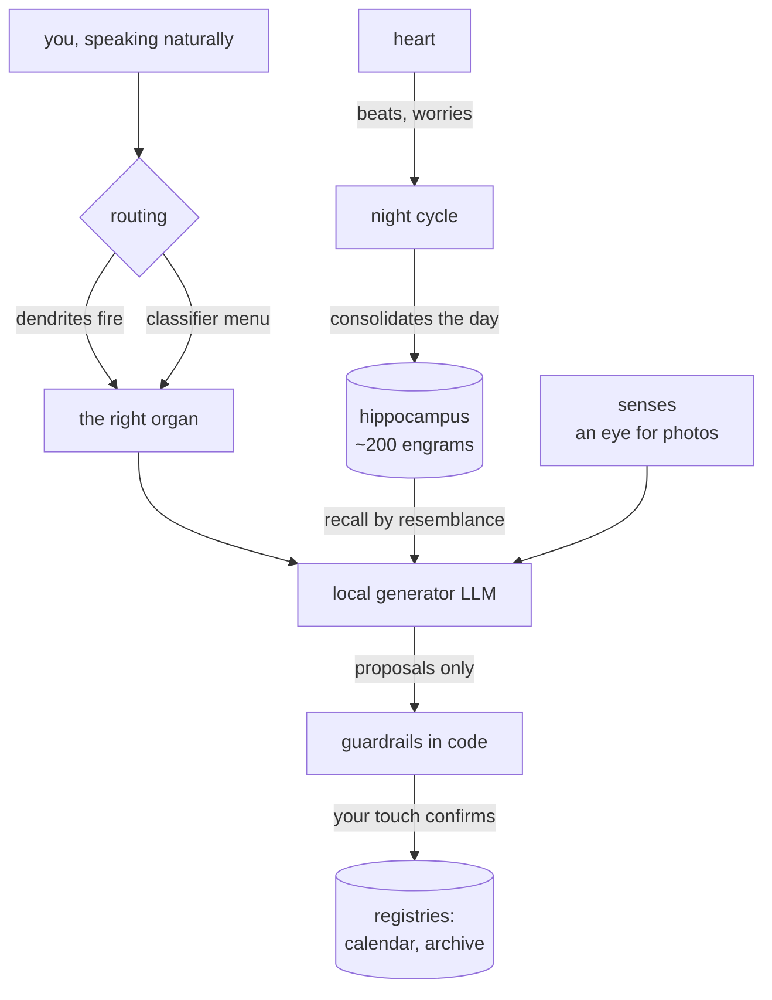
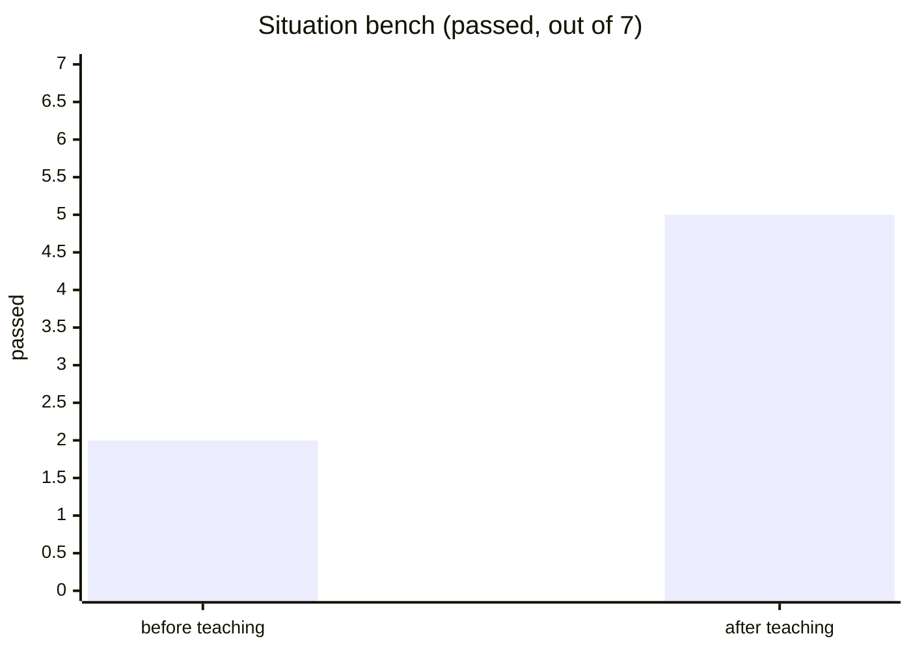
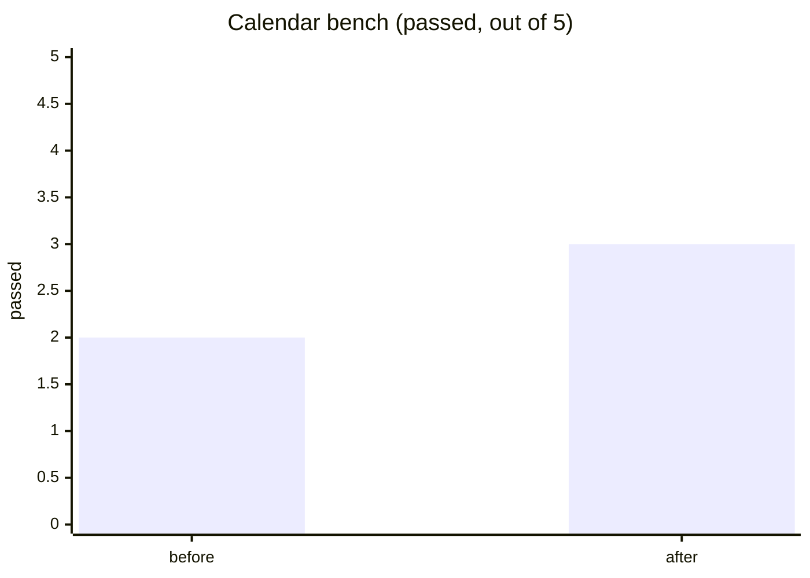
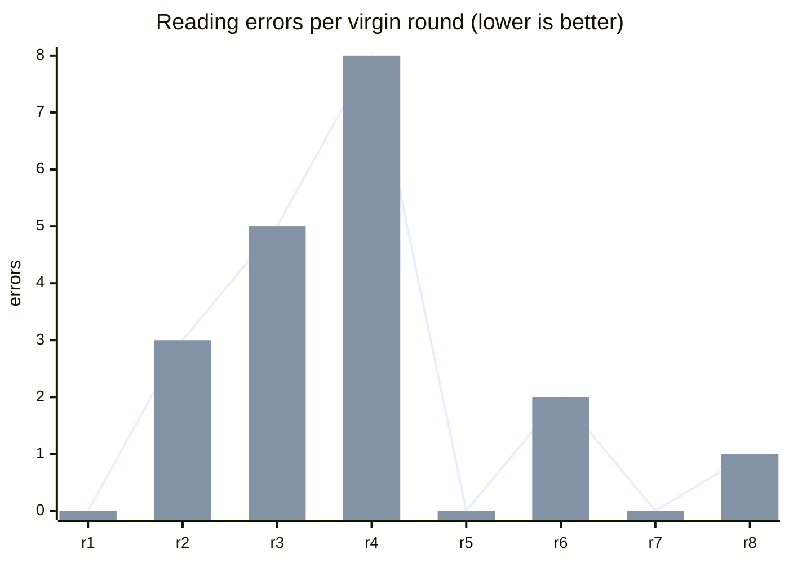
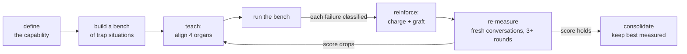

# Grindstone Research Book

*the public notebook of a private experiment — grindstone-eleven*

Somewhere in northern Italy, on ordinary consumer hardware, a small
system is being **raised rather than programmed**. It runs entirely at
home: no cloud, no telemetry, no data leaving the house. That
constraint is not a limitation of the project — it *is* the project.

> **This file is the project's living document.** Findings land here as
> they mature. The original `grindstone` README is deprecated and kept
> only as history.

---

## The idea in one line

**Behaviors are memories, not code.** Every capability the system gains
is taught — grafted as a discrete memory with its own triggers,
recalled by resemblance, reinforced when it serves and weakened when it
fails — and every claim of learning is backed by a measured score.

## Architecture, briefly

Every organ follows one standard: **declared functions** (a manifest),
**written rules** (a mandate in plain text — corrected by teaching,
never by editing code), and **hard guardrails** (contracts the model
cannot negotiate). What the model proposes, deterministic hands verify
before anything is written — and writing happens at a human's touch.

## Measured results (the graphs that went up)

An independent critic model judges every answer's coherence before
delivery — benchmarked at **19/20** on its confusion matrix.

Capabilities are trained through a written protocol and measured on
benches of trap-situations, before and after teaching:

### The photograph experiment (September 2026)

Can a frozen model learn to read a photographed shift-sheet — a messy
real-world grid — through **memory grafts alone**? Every round is a
fresh conversation with no notes to lean on: if the score improves,
the improvement lives in the system's memory, nowhere else.

Rounds 1–5: the lessons existed but **never woke up** — the memories'
triggers sat too far from the user's real phrasing, and recall stayed
silent. Rounds 6–8, after reshaping the triggers and teaching a
two-step method (*transcribe the row aloud, then extract from your own
transcription*): errors collapsed. Three lessons entered the protocol:

1. **A graft must be woken** — after every graft, test recall with the
   user's real sentence. A memory that never fires is a sleeping neuron.
2. **For visual tasks: two steps** — anchor visual attention to words
   before extracting.
3. **Too much procedure drowns the apprentice** — a stricter checklist
   *lowered* the score and was rolled back. Like model checkpoints:
   the best *measured* version is kept, not the latest written.

### Other results that held

- **Recurring events as seeds** — one stored entry germinates its
  occurrences forever (yearly, monthly, month's-end) when a month is
  viewed: verified out to 2031 and beyond, registry stays tiny.
- **Dictation as the only interface** — the personal calendar is driven
  by natural speech alone: creation, deep modification, deletion
  (the model reads the live agenda and names exact entries; code only
  finalizes exact matches).
- **Self-poisoning cured by memory** — a long chat in which the system
  once denied a capability used to poison every later answer; a grafted
  *capability memory* («you can do X; if you said otherwise, it was an
  error») ended the relapses.
- **Corrections that stick** — mistakes are charged to the specific
  memories that caused them (pain), the lesson is grafted back, and the
  same bench re-measures. Praise reinforces. Bench scores above.

## The training protocol (distilled from failures)

Four organs must align for any new capability: the **routing dendrites**
(real phrases → right room), the organ's **mandate**, a **capability
memory** recallable from any room, and the **dispatcher** that must be
introduced to the newcomer. Nearly every failure so far was exactly one
of these four left behind.

## What comes next

A model of its own, **grown from zero** on the same desk — tiny, modern
in architecture (a mixture of small experts behind a learned router),
raised area by area with a curriculum, each area guarded by its own
bench so new learning can never silently break old. It has a name
already. It will earn its page here when it earns its scores.

## What stays private

The code, the library, the memories and the life inside them belong to
the person the system serves. They remain in the private garden.

*Active research, summer 2026 →*
