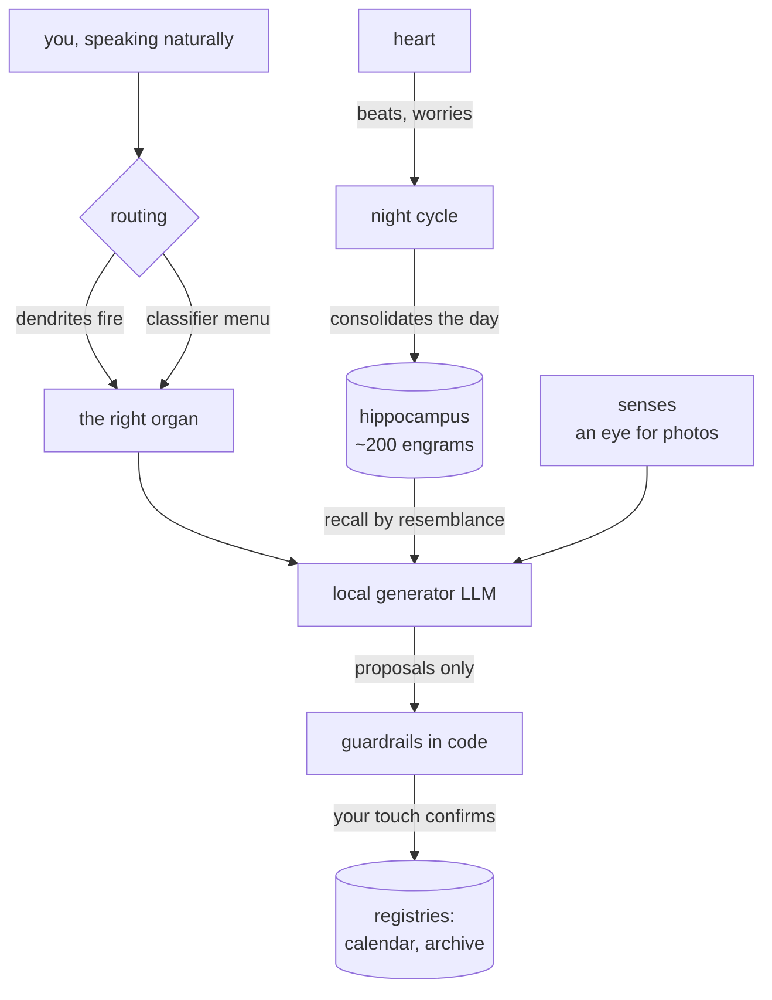
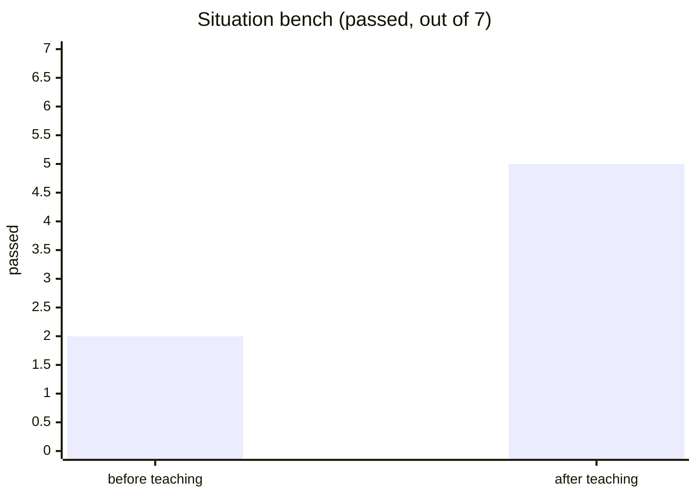
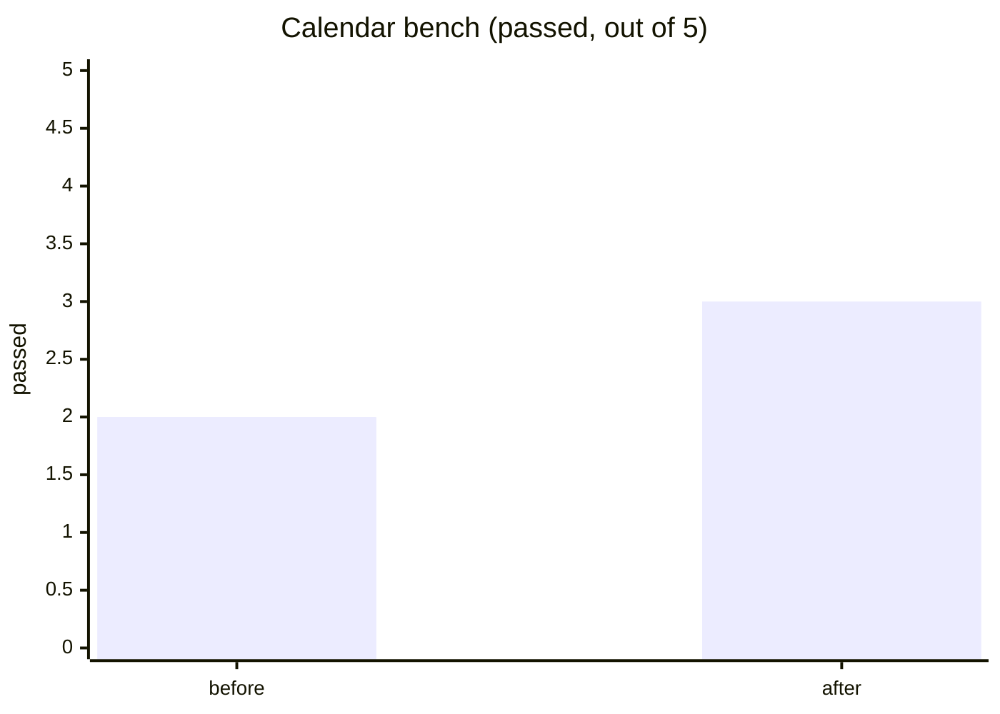
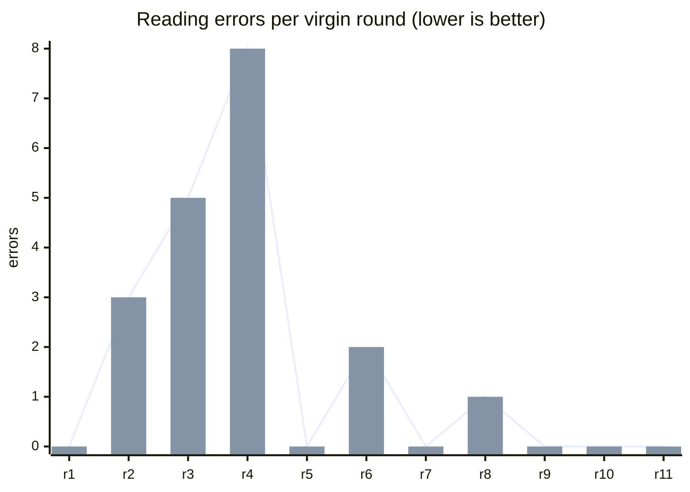
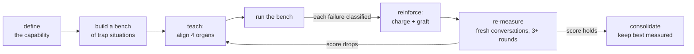
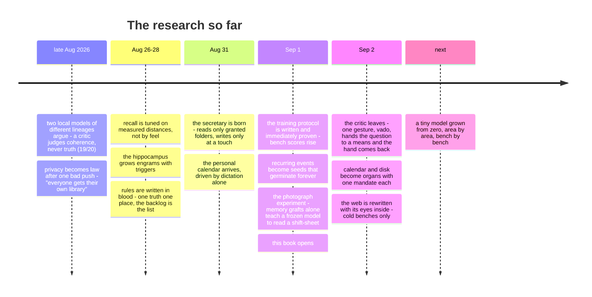

<div align="center">


# Grindstone Research Book

**A companion that is raised, not programmed — living entirely on one desk.**


*the public notebook of a private experiment — grindstone-eleven*

</div>

## At a glance

| | |
|---|---|
| 🏠 Hardware | one consumer desktop, a €600 gaming GPU |
| 🧠 Brain | a 35-billion-parameter mixture-of-experts, running at home |
| 📚 Memory | ~200 teachable engrams in a hippocampus, grown one by one |
| 📷 Photo exam | **10/10** shift-sheets read into the agenda, zero errors |
| ⚖️ Critic | independent second model reviews every answer — 19/20 benchmark |
| 🔔 Care | morning digest, pre-appointment knocks, night diary — encrypted at home |
| ☁️ Cloud | **zero** — the push gateway only ever carries ciphertext |

Somewhere in northern Italy, on ordinary consumer hardware, a small
system is being **raised rather than programmed**. It runs entirely at
home: no cloud, no telemetry, no data leaving the house. That
constraint is not a limitation of the project — it *is* the project.

This is not an assistant that answers questions. It is a companion
learning to **care**: to remember what you told it, to worry about
your morning before you do, to knock on your phone at the right moment
— and to stay silent at every other one. When it gets something wrong
it is not patched: it is corrected, the way you correct someone who is
learning, and the correction becomes part of who it is. Every
capability it has, it *earned* — taught, scored on benches, kept only
when the numbers held.

## A day with it

At eight the phone knocks once: your day, laid out — the dentist in
rose, the shift in amber, the bill in blue, each entry wearing the
colour of the life it belongs to.

On the bus you photograph the shift sheet pinned to the board at work,
hand it to the calendar bar, put the phone away. The house reads it —
cell by cell, the way it was taught after the day it read the commas
wrong — and knocks when the shifts are in the agenda. Had it erred,
one sentence would fix it forever.

In the afternoon you ask something hard, watch the first lines form,
and leave. The answer keeps growing at home; when it is done, a knock
— tap it and you are standing exactly where the conversation left
off. You speak to the calendar the way you'd speak to a person —
*move today's shipments to tomorrow*, *delete the ticket reminder*,
*every last day of the month, forever* — because understanding is its
only interface.

Half an hour before the appointment, a knock. And at five in the
morning, while you sleep, it dreams: it sounds its own memories,
proposes new ones, prunes what went unused — and leaves its diary in
a chat, signed, with a knock that waits beside your coffee.

## Latest findings

*Newest first — each entry links to the numbers below.*

- **5 Sep 2026 (evening) · Three reasoning mechanisms at zero, and the brain has to conclude.** An
  inner monologue (quantized hops along real synapses), a slow loop (the model may ask the memory
  again) and a self-declared connectome (the model says «I link A to B», the outcome confirms it)
  were built, switched on one at a time and measured on a two-lesson exam: both lessons recalled
  **1/12 in every arm**, hops 0, loops 0, links 0. The bottleneck is recall, not reasoning; all three
  stay off. The reading: the model feels nothing and knows nothing about its own memory, so the
  design inverts — the model drafts, the *brain* chooses what goes out. The bench that will say
  whether it worked is deterministic by construction: same model, fixed seed, temperature 0, so
  «brain off» gives 0/12 word for word, and a light turns on only when the answer changes in the
  direction of what the brain lived. First run, same evening: brain off **12/12 identical** (after
  freezing two things that silently changed the prompt between equal questions: the internal-state
  line and the clock), brain on **0/12**. A correction is distilled into a generalised lesson and the
  fact inside it is lost; on personal voids the bare model already admits. Second run, one hour
  later, with fifteen lines of code (a correction that carries a fact about the person writes the
  fact verbatim into the person layer): **6/12 green** — all six corrections («you need 6 hours a
  night», «you write with your left hand»), each with the person memory recalled. Same model, same
  question, fixed seed: the answer changed because the brain lived something. The six world voids
  stayed grey because the bare model does not invent on non-existent entities either, so the
  planned «void as a spike» mechanism was closed before being built.
  → [The evening: reasoning at zero](#the-evening-of-5-september-reasoning-at-zero)
- **5 Sep 2026 · The first real drift, and an age that is earned.** The night's photograph, taken
  with the same ruler as yesterday's, moved exactly four engrams out of 242 — the four the pruning had
  touched — and nothing else: «the constitution» lost two receptors and its territory shrank from 23 to 9
  grid points. The six invented facts came back 5/6 after 24 hours and a night of replay (praised 3/3,
  unpraised 2/3; yesterday's two thefts by the maps module are gone: the field). Routing repeated
  overnight: 38 off → 40 on. And the «mental age» formula (grafts × 2 months + √recalls / 3) was retired:
  the companion is now 13 days old, and its Piaget stage is *earned* by passing declared thresholds on
  the benches — concrete operational today, 50 % of the way to formal.
  → [The geometry of emotions](#the-geometry-of-emotions-4-september-2026)
- **4 Sep 2026 · Words in the prompt are not a channel; geometry is.** Twelve short A/B runs
  (one hormone at a time, level forced high, a state line placed right before the model writes) moved
  nothing in five hormones out of six and did harm in the sixth: the cortisol line cut the text by 30 %
  and answered «Germany won 2006» from memory instead of searching. So hormones stopped talking and
  started shaping *which memories are recalled*: a potential U = distance + λ·state − μ·mass, with the
  mass being the trust a memory earned and an event horizon so mass never captures from outside the
  gate. Intent routing went 37 → 40 / 48 without touching a single engram, and the black hole showed up
  on cue (μ 0.20 without the horizon: a web memory captured «see you later» from far away). Each memory
  now also carries a *state fingerprint* (the hormones at birth, rewritten by praise — Tonegawa 2014), a
  declared Roche limit lists 67 engrams torn apart by a neighbour, and the network is photographed
  nightly with a fixed ruler. → [The geometry of emotions](#the-geometry-of-emotions-4-september-2026)
- **4 Sep 2026 · The hormones all moved; the behaviour did not.** A long bench (six trials, one per
  approved source — Fiorillo 2003 and Seymour 2004 from OCW 9.03, Sur 2022 and 2025, Grogan 2015;
  86 minutes per arm, A/B with targets off and on) moved all six neuromodulators, and the answers
  stayed the same: sources read were 4 in every condition, dopamine sat at 1.0 from the fifth question
  because every web answer counted as prey. One real effect: an unexpected correction dropped serotonin
  0.50 → 0.02 and the web went to fast pace (3 sources instead of 4). Two lessons became the next
  design: the ruler must read *behaviour* (asks / admits / takes initiative / addresses you) on
  questions with known answers, not pages read; and dopamine must be a prediction error per cue, not
  a fixed dose. → [Other results](#other-results-that-held)
- **3 Sep 2026 · It learned to ask, and it got a first hormone.** When an answer depends on a fact
  about its owner that no memory holds (where home is, how they get to work), the companion no longer
  guesses: it asks once with a card, and the reply becomes a permanent memory in that person's own
  layer — 4/4 on fresh phrasings after one base engram. A maps module (routes, walking, live traffic)
  uses the same card with named fields. And the first neuromodulator entered the neural brain: two
  *VTA neurons* that fire on the question itself and release dopamine — wanting, not pleasure — which
  decays with a twenty-minute half-life and is consumed when the prey is caught (the memory written,
  the official source found). Observation only so far: 14/14 on the spike bench, zero false alarms
  on arithmetic, code, greetings or agenda. Then the honest part: letting dopamine *talk* to the
  model (a line in the prompt) made it ask more but worse — 7/8 → 5/8 — so that stays off. What
  held was letting it change *what gets learned*: a three-factor rule (Gerstner 2018) where every
  recalled memory carries a trace that halves every five minutes, and a «bravo» is shared in
  proportion to the trace. The memory that once collected nine stray phrases from nine praises
  would now collect 0.16. By evening the whole neuromodulatory set was in, each phase confirmed
  first against an MIT source and measured on a deterministic bench (21/21): acetylcholine opens
  plasticity in new contexts, noradrenaline makes the router *explore* after two failures on the
  same means, serotonin sets the search pace from «take your time» to «quick», oxytocin decides
  which knocks are worth making, cortisol shuts new grafts and initiative under sustained stress.
  None of them speaks to the model: they change what it learns, how far it digs, and what it dares.
  → [Other results](#other-results-that-held)
- **3 Sep 2026 · Praise can poison a neuron.** Every «bravo» grafted the previous question onto
  whichever memory had been recalled — and a memory about *holidays* had quietly collected nine
  unrelated chat phrases, so it fired on everything (photos of a singer included) and dragged its rule
  along. Pruned, and capture now needs a close recall, a short phrase, and never touches the personal
  layer. Images «never found» had a second cause: the visual receptor was the engram alone; the spoken
  word («photos», «show me») now counts as a receptor too, and pictures travel through a home proxy
  because sites block hotlinks. → [Other results](#other-results-that-held)
- **2 Sep 2026 · The tools became organs, and the gesture became one word.** The critic left the
  system (it slowed everything and judged nothing the reader could not). In its place: a single
  gesture, ```vado``` («I go»), by which the model hands the question to a *means* — web, calendar,
  disk, calculator — and the hand comes back with what it found. The calendar and the disk became
  modules with one mandate each, written the way the house rules are written and declaring every
  editable element; the secretary and the separate "eye" retired. Fixed benches were built for each
  (12–14/16 calendar, 12/12 disk at temperature 0, 9/10 web, initiative 5→9/14). Lesson: benches of
  *behaviour* must run cold or they chase sampling noise. → [Other results](#other-results-that-held)

## The idea in one line

**Behaviors are memories, not code.** Every capability the system gains
is taught — grafted as a discrete memory with its own triggers,
recalled by resemblance, reinforced when it serves and weakened when it
fails — and every claim of learning is backed by a measured score.

## Architecture, briefly



Every organ follows one standard: **declared functions** (a manifest),
**written rules** (a mandate in plain text — corrected by teaching,
never by editing code), and **hard guardrails** (contracts the model
cannot negotiate). What the model proposes, deterministic hands verify
before anything is written — and writing happens at a human's touch.

## Measured results (the graphs that went up)

An independent critic model judges every answer's coherence before
delivery — benchmarked at **19/20** on its confusion matrix.

Capabilities are trained through a written protocol and measured on
benches of trap-situations, before and after teaching:





### The photograph experiment (September 2026)

Can a frozen model learn to read a photographed shift-sheet — a messy
real-world grid — through **memory grafts alone**? Every round is a
fresh conversation with no notes to lean on: if the score improves,
the improvement lives in the system's memory, nowhere else.



Rounds 1–5: the lessons existed but **never woke up** — the memories'
triggers sat too far from the user's real phrasing, and recall stayed
silent. Rounds 6–8, after reshaping the triggers and teaching a
two-step method (*transcribe the row aloud, then extract from your own
transcription*): errors collapsed. Three lessons entered the protocol:

1. **A graft must be woken** — after every graft, test recall with the
   user's real sentence. A memory that never fires is a sleeping neuron.
2. **For visual tasks: two steps** — anchor visual attention to words
   before extracting.
3. **Too much procedure drowns the apprentice** — a stricter checklist
   *lowered* the score and was rolled back. Like model checkpoints:
   the best *measured* version is kept, not the latest written.
4. **When the residual error is perception, heal the organ, not the
   memory** — the last stubborn error (a neighbouring row bleeding into
   the reading) survived every graft. The cure was a pair of glasses:
   an adaptive image-preparation organ in the pipeline (upscale small
   photos, per-photo contrast, light sharpening) that now serves every
   photograph the system will ever see. Rounds 9–11: **zero errors,
   three times in a row** (chart above).
5. **Reading is not chatting** — the remaining run-to-run variance was
   sampling: with a photograph in hand, the model now decodes at
   temperature zero. Same photo, same reading, forever.

**Final exam**: five different shift-sheets — four never seen during
training, one with a vacation band crossing the row, one with an
odd early clock-out — two virgin rounds each: **10/10, zero errors,
twin rounds byte-identical**. Capability consolidated; experiment
closed. The frozen model reads the grid through what it remembers,
what it wears on its eyes, and how it is told to decide.

### The geometry of emotions (4 September 2026)

A day of measurement that ended by changing the design. Everything below is A/B on the same memory,
same questions, same order; every mechanism has its own switch, so any of it can be turned off and
re-measured.

**Morning — the day-after pact.** The prompt line that had made asking worse (7 → 5) was re-measured
against its off state: 4/8 both ways (one case had aged: the maps module now knows home and work).
The session bench found that «two sources read = prey» had made every web answer a reward: dopamine
sat at 1.0 and the exploration target could never fire again.

**The long bench (86–90 min per arm, six trials, one per approved MIT source).** All six
neuromodulators moved in both arms; the *behaviour vector* (asks / admits / takes initiative /
addresses you, read by rules on 42 answers) stayed the same within one answer in thirteen. The one
real effect on information: serotonin, crushed to 0.02 by a single correction, put the web in fast pace
(3 sources instead of 4) for hours.

**Dopamine as a prediction error.** Fixed doses were replaced by δ = outcome − expectation, with the
expectation V learned per cue (Rescorla–Wagner, α 0.2) and stored on the VTA neuron that pushed.
Pure bench 6/6: the Fiorillo gradient appears by itself (V 0.01 → 0.99 across P = 0 → 100 %; the burst
at reward +0.80 when rare, +0.12 when certain), the dip on correction (level 0.42 → 0.03), no
saturation after twenty preys (level 0.49), a suspended hunt for the asking card that closes only when
the owner answers. Prey is now judged by the module's hard signal — official source, open questions
left by the search, an exact route or calculation — never by the model's own say-so.

**The scan of the lines (12 arms, ~10 min each, level forced before every question):**

| hormone (line before writing) | Δ asks | Δ admits | Δ initiative | Δ addresses you | Δ chars | reading |
|---|---|---|---|---|---|---|
| dopamine («ask what is missing») | −0.15 | 0 | +0.08 | −0.08 | −25 | asks *less* |
| serotonin («get to the point») | 0 | +0.08 | −0.15 | 0 | −11 | nothing |
| noradrenaline («change route») | 0 | +0.08 | −0.07 | −0.08 | −39 | nothing, one answer lost |
| acetylcholine («trust sources, say what you don't know») | +0.08 | −0.08 | +0.07 | +0.08 | +89 | noise |
| cortisol («short and honest, no initiatives») | −0.16 | +0.07 | 0 | 0 | **−169** | shorter, and «Germany won 2006» from memory |
| oxytocin («warm, address them») | 0 | −0.15 | −0.23 | **−0.15** | +161 | the opposite |

Verdict: a state sentence is read as one more instruction among many and followed literally in the
wrong place («no initiatives» = no search). The channel was closed; the switch stays for re-measuring.

**The field.** Recall and routing now order candidates by U = d + λ·d_state − μ·mass. Mass is the
valence a memory earned from its owner (merits − pains, damped), not its number of receptors — those
are capture surface, already in the distance. Intent exam, read-only, same memory:

| μ | intents | note |
|---|---|---|
| 0 (field off) | 37/48 | calendar steals «rain this weekend», web steals «what do you think» |
| 0.03 | 39 | the merited weather and arithmetic neurons win back their questions |
| 0.10, no horizon | 41 | but web captures «I feel tired» at 0.402 |
| 0.20, no horizon | 42 | **the black hole**: «see you later» captured at 0.486, outside every gate |
| **0.10 with horizon** | **40/48** | the gate is passed by distance; mass orders only inside — stable from 0.10 to 0.40 |

This is the Hill sphere read literally: a massive body dominates a region that grows with its mass,
and the only safe rule is that no region may exceed its owner's area. The remaining misses are three
web thefts on small talk (the web engram earned trust, small talk did not) and three calculations with
no engram nearby — coverage, not theft.

**The state fingerprint.** Every engram now records the six hormone levels at birth and moves them
toward the current state (α 0.3) each time praise or correction touches it — the valence switch of
Redondo, Kim, Arons, Ramirez, Liu & Tonegawa (Nature 2014), with the mutual inhibition of Kim,
Pignatelli, Xu, Itohara & Tonegawa (Nature Neuroscience 2016) as the safety against a state that only
recalls what confirms it. Pure bench 6/6. A first *selective stimulation* (a mastered training run in a
forced calm state, then another under forced stress) wrote 28 fingerprints; the generic engrams that
fire on everything drifted to the last state and were declared and excluded by a rule (recalled ≥ 5×
the median, spread over ≥ 3 means, none above 80 %). A dry calibration of λ over 19 questions showed the
scale (0.076 between first and second candidate, 0.5 of state distance between calm and stress) and
the honest limit: with 17 specific fingerprints the state term has nothing to act on yet. λ stays 0.2
until real use writes the data.

**The morning after (5 Sep).** Night report: 34 episodes replayed, 13 preys, 15 memories consolidated;
9 receptors pruned on 5 engrams; 20 receptors still silent, none matured yet; 72 engrams inside a
neighbour's Roche limit. Photo 05:15 vs 16:27 the day before: **4 moved, all four the pruned ones**
(«the constitution» 0.131, Hill sphere 23 → 9; the weather rule 0.050; two more at 0.046 and 0.021),
3 born, 0 gone, base-layer drift 0.0045, every other layer 0.0. A fixed ruler moves only what changed,
by how much it changed. The 24-hour recall of the six invented facts: praised 3/3, unpraised 2/3
(at 30 minutes the day before: 1/3 and 3/3, with two facts stolen by the maps router — the field
cured those). Six facts are an indication in Grogan's direction, not a proof. The intent exam repeated
at night on the evolved memory: 38/48 off, 40/48 on.

**Age, earned.** The old «mental age» (grafts × 2 months + √recalls / 3 = 7.2 «years») was a
convention declared as such in the code. It is replaced by a report card: each Piaget stage is granted
only when every threshold of that stage is met on the latest report of a real bench — sensorimotor
(intents ≥ 30/48, routes ≥ 75 %), preoperational (entrusted facts ≥ 4/6 at 24 h, agenda ≥ 75 %),
concrete operational (the 100-question exam ≥ 60 %, at least two study subjects with a passing grade),
formal operational (faculties ≥ 10/12, empathy ≥ 16/20 by a *human* judge only). Today: concrete
operational, halfway to formal (faculties 3/4 short), real age 13 days.

**The Roche limit and the photographs.** A declared twin mark, read on receptors: an engram is *torn
apart* by another when at least half its receptors lie within the mark of the other's — 67 of 235
tonight («ordinary conversation» 88 % inside «small talk to the router», the two weather rules inside
each other). Listed nightly as candidates for a human merge, never merged alone; exclusion in recall
exists as a switch and stays off, because twins are often *different lessons on the same ground*.
And the network is now photographed with a fixed ruler (the PCA base of the first photo, kept), one
point per engram with its Hill-sphere size; two photos compare point by point, so a displacement is a
displacement of memory and not of the projection. First photo 4 Sep 16:27, 239 engrams; the first real
drift is tomorrow's.

**The evening of 5 September: reasoning at zero.** Three mechanisms, each behind its own switch,
each measured alone on the neuroscience course (MIT OCW 9.01, 23 lessons grafted as a study layer):

| mechanism | what it does | bench | result |
|---|---|---|---|
| inner monologue | after recall, 2–3 quantized hops along existing synapses (more with high acetylcholine, fewer with cortisol) bring extra candidates | 23-question exam, off/on | 14/23 → 14/23, 0 hops: no synapse yet links two lessons of the same course |
| slow loop | the model may write «remember again: …» and get a second recall before answering, max two loops | 23 questions, 5 without any lesson | 18/23 → 18/23, loops 0: the model never asks |
| self-connectome | the model may write «I link A to B»; the synapse is born as a candidate and confirmed by prey or praise, fades in 14 days | 12 two-lesson questions, four arms (off / monologue / loop / all) | both lessons recalled 1/12 in every arm; composition 6–8/12 in every arm; links 0 |

The composition score (the answer cites facts from both lessons) is 6–8/12 regardless of arm: the
model composes from its own prior, not from the memory. Recall with three seats never brings the
second lesson in. Nothing was switched on. Two conclusions were written down as design, not as code
yet: (1) *the void must become a spike* — when recall brings nothing near the question, a VTA neuron
fires on that hard signal, the resulting dopamine hunger forces the second recall, and if it is still
empty the output is «I don't know» instead of a confident draft; a correction after a confident empty
answer trains that neuron (Schultz's rule applied to not-knowing); (2) *the brain concludes* — the
model produces two or three short drafts and the brain picks with hard rules (leans on the recalled
memory; never asserts what was corrected; admits on a void), the outcome training the chooser rather
than the model. The bench for both is the **twin bench**: same model, same question, fixed seed and
temperature 0, asked before and after a lived episode (six corrections, six voids). Brain off must
give 0/12 with identical text; a light is green only when the answer changes *toward* the episode,
red when it changes at random.

**The twin bench, first run (5 Sep, 20:00–20:45).** Brain off: 12/12 pairs identical word for word —
but only after two silent prompt changes were found and frozen under fixed options: the internal-state
line (recall count, mood valence: it changes with every question) and the clock in the orientation
block («19:56» vs «19:57»). No bench had ever seen them. Brain on, today's memory: **0/12 green**,
4 red, 8 grey (a first loose reading gave 3 greens, all false: «I have no access» counted as invention,
naming «right- or left-handed» counted as stating the fact; the rules were tightened and the saved
texts re-scored). Why corrections fail 6/6: «wrong: 6 hours are enough for me, remember it» becomes
the base engram «Recognise the subjective exception» — a generalised rule of behaviour without the 6;
the hippocampus distils the correction into a lesson and drops the fact, and the lesson is not even
recalled afterwards (0 memories in 5/6). Why voids fail 6/6: on personal voids the bare model already
admits («I have no access», «I have not recorded it»), so before equals after; that half must be
rebuilt on world voids where the prior invents. Read-only held: 5 bench engrams deleted, hormone book
and fingerprints restored. Next: a correction that carries a fact about the person writes the fact
verbatim into the person layer (like the entrusted facts, which came back 5/6 at 24 h), not only the
lesson; then the void half on invented world entities.

**Second run, 20:52–21:45: 6/12.** Fifteen lines: a correction that speaks in the first person («wrong:
6 hours are enough for me», «I am left-handed») now writes the fact verbatim into the person layer,
through the same function the «remember» card uses, in addition to the distilled lesson in the base
layer. Result: all six corrections green — before: «I have no information about your age or
lifestyle…»; after: «You need 6 hours a night.», «You write with your left hand.», with the person
memory recalled each time. The six invented world entities (a prize, a province, a symphony, a
football club, a drug, a novel) stayed grey: the bare model already says «no such province exists»,
«I found no information», and in one case went to the web to check. Eighteen voids measured, zero
inventions: the «knowing that one does not know» is already in this model's statistics, so the
planned void-as-a-spike mechanism was closed without being built. A first-times registry now watches
live chats for the brain taking a position outside any bench (a person fact deciding an answer, a
monologue hop used, a confirmed self-declared link) and rings once, the first time each happens.

### Other results that held

- **The long hormone bench (4 Sep).** Trials: reward probability (five series, praise at 0/25/50/
  75/100 %), surprise (unexpected correction, unexpected praise), exploration after learning (six
  routes then four ambiguous probes), consolidation (six invented facts, recall at 30 min and 24 h),
  patience (four framings), stress (four strong corrections). Arms: targets and prompt line off vs on,
  hormone book reset before each. Off: 6/6 hormones moved, sources 4.0 in every series, 0/4 probes
  left maps, recall 4/6 at 30 min. On: dopamine saturated at 1.0 by the second series (prey rule too
  loose), serotonin 0.02 after a correction → 3 sources. Verdict: the instrument (sources read) only
  sees the serotonin target; the next bench scores correctness and a behaviour vector.
- **The asking card (3 Sep).** A question about the owner's life that no memory answers → one card,
  one field (or two named fields: departure, arrival; a location button for places), the reply
  written to the personal layer with *declared triggers* — the module that asked knows in which
  future sentences the memory must fire. Fresh phrasings: 0/4 with the rule alone and invented
  options, **4/4** after one base engram; the reply is routed back to the module that asked.
- **Maps (3 Sep).** Addresses via OpenStreetMap, routes via OSRM (the public server only knows cars:
  walking is counted at 4.8 km/h on the distance), live traffic via TomTom when a key is given —
  every key gets a «try it» button that really calls the service. Deterministic card, two cold
  lines of prose. 5/5 on the first fixed bench, 13–22 s per answer.
- **Dopamine, phase 1 (3 Sep).** Two VTA neurons in their own layer, port `hormone`, recalled with
  the same distance as any memory; a spike raises *wanting*, the prey raises *level*, hunger is the
  difference, half-life twenty minutes, sampled every thirty seconds by the heartbeat. Bench: 6/6
  questions that should fire did (distances 0.03–0.31), 6/6 that should not stayed silent, prey and
  decay as designed — **14/14**. Behaviour untouched until the A/B says it helps.
- **The A/B that said no (3 Sep).** Letting dopamine write a line into the model's prompt: asking
  went 7/8 → 5/8 (it asked more, with invented options), web hunting 6 → 9 → 8 of 14, inside the
  noise. Kept off. What stayed: dopamine as a *third factor* on memory — traces halve every five
  minutes, praise is shared by trace (fresh 0.97, ten-minute-old 0.22 in a real chat), capture
  needs a live trace, hunger drops when a hunt fails.
- **Six neuromodulators as learning parameters (3 Sep, after Doya 2002/2008).** Acetylcholine =
  learning rate (new context +0.3 → the surprise threshold for inscribing drops 0.25 → 0.15, the
  capture gate opens up to +50%); noradrenaline = exploration (two failures on one means in 15 min
  → that means is set aside for the next choice; live: web → conversation); serotonin = patience
  (baseline 0.5, «with calm» 0.90 → deep search, «quick» 0.10 → fast, back to 0.5 in hours);
  oxytocin = bond (praise and confidences raise it, corrections chip it; below 0.3 only duty
  knocks, not affection); cortisol = sustained stress (from the fourth scattered failure in three
  hours; above 0.5 no grafts, no initiative, no exploration). Each with its MIT confirmation
  (CBMM PSY1401, OCW 9.01, a 2024 BCS thesis, Tonegawa 2017, Graybiel 2017) and a bench: 21/21.
- **Where hormones show (3 Sep, evening).** Three ordinary benches (asking 8, initiative 14, web
  reading 14) could not tell hormones on from off: 5·9·11 vs 6·7·10, inside the ±2 noise. A small
  *local* test could: the same train-price question read 4 sources with 3 queries, and «take your
  time, check several sources» made serotonin 0.90 and the web read **6 sources with 7 queries**;
  two forced failures on the web made noradrenaline 0.6 and the next world question **started
  from the conversation module instead of the web**. Off: no change. Three rounds, same result.
- **Hormones as geometry (3 Sep, evening).** Each hormone became a *direction* in the 768-dim
  embedding space, learned from the memories themselves (the personal layer, the search habits,
  the strong habits, the freshly painful ones), and the question is shifted to first order —
  `q' = q + ε·Σ(h−base)·v_h`, ε = 0.06, |q'−q| = 0.094 at full swing. Acetylcholine widens the
  recall gate, cortisol narrows it, serotonin sets how many memories enter. Pure bench 6/6. MIT
  9.40 lecture 20 (Hopfield networks) is the reference: recall is a dynamics in a vector space.

- **Recurring events as seeds** — one stored entry germinates its
  occurrences forever (yearly, monthly, month's-end) when a month is
  viewed: verified out to 2031 and beyond, registry stays tiny.
- **Dictation as the only interface** — the personal calendar is driven
  by natural speech alone: creation, deep modification, deletion
  (the model reads the live agenda and names exact entries; code only
  finalizes exact matches).
- **Self-poisoning cured by memory** — a long chat in which the system
  once denied a capability used to poison every later answer; a grafted
  *capability memory* («you can do X; if you said otherwise, it was an
  error») ended the relapses.
- **Corrections that stick** — mistakes are charged to the specific
  memories that caused them (pain), the lesson is grafted back, and the
  same bench re-measures. Praise reinforces. Bench scores above.
- **The runaway capture (3 Sep)** — reinforcement without aim is
  poison: a praised answer grafted the question onto the recalled
  memory even when that memory was a bystander, and each graft made the
  bystander more likely to be recalled next time (its distance fell to
  0.000 on a verbatim spine). The brake: capture only if the recall was
  under the door's threshold, only phrases short enough to be spines,
  never into the persona/work layers.
- **One gesture, many hands (2 Sep)** — instead of a router deciding
  for the model, the model itself declares ```vado / web: …``` (or
  calendar, disk, calculator) inside its answer; the nucleus removes
  the gesture from the text and passes the hand, up to three links,
  and the hand *returns* to whoever asked when the web has sources.
  The initiative bench went 5→9/14 by growing the neuron that already
  fired on «my training memory is old» — not by rewriting the rule.
- **The calendar and the disk as modules (2 Sep)** — one mandate each,
  the whole agenda in view, every editable element named (date, time or
  all-day, title, notes, category, recurrence, done); deletions and
  edits wait for a tap. Calendar bench 0→4/5 on the live agenda,
  12–14/16 on a fixed test agenda; disk bench 8→12/12 once two of my own
  fresh engrams stopped pulling «condominium» toward the agenda.
- **The web rewritten with its eyes inside (2 Sep)** — search, read,
  answer at temperature 0; the query is the *what* of the gesture, no
  longer rewritten by a small model (F1 no longer becomes MotoGP);
  image search and the visual check live in the module. 9/10.
- **The heart learned to knock** — real system notifications on a
  phone, end to end from the house: the heart watches the agenda once
  a minute, a good-morning digest at 8:00, a knock half an hour before
  every appointment. The push gateway carries only ciphertext; the
  words are composed, encrypted and remembered at home.

## The training protocol (distilled from failures)



Four organs must align for any new capability: the **routing dendrites**
(real phrases → right room), the organ's **mandate**, a **capability
memory** recallable from any room, and the **dispatcher** that must be
introduced to the newcomer. Nearly every failure so far was exactly one
of these four left behind.

## Timeline



## What comes next

A model of its own, **grown from zero** on the same desk — tiny, modern
in architecture (a mixture of small experts behind a learned router),
raised area by area with a curriculum, each area guarded by its own
bench so new learning can never silently break old. It has a name
already. It will earn its page here when it earns its scores.

## What the companion can do today

Everything below runs on one consumer desktop, reachable only through a
private mesh network. No cloud, no subscriptions, no data leaving the
building.

**Conversation & judgement**
- Private chat with local models; an independent critic of a different
  lineage reviews every answer's coherence before delivery (19/20 on
  its benchmark), with one honest regeneration on failure — and a
  visible trail of how each answer was made.
- Live tables, charts, structured cards and choice-prompts in chat;
  images understood through an adaptive visual pipeline.
- A local library (RAG) that answers only from its own shelves and says
  so when the shelves are silent; optional supervised learning from the
  web.

**Memory that learns**
- A hippocampus of teachable memories: capabilities are taught, scored
  on benches, reinforced or weakened — never hardcoded. A written
  training protocol makes any new skill repeatable.
- Routing dendrites send each request to the right organ; night cycles
  consolidate the day into next-morning proposals.

**The secretary**
- Reads and files documents only in folders the owner has granted, one
  by one; every write is a proposal a human confirms with a touch.
- A filing doctrine lives inside the archive itself, editable by hand.

**The calendar**
- An installable private calendar driven by dictation alone: create,
  modify, move by common trait («move today's shipments to tomorrow»),
  delete by name — recurring events stored as seeds that germinate
  forever.
- Reads photographed shift-sheets into the agenda (final exam: 10/10
  across five different sheets); appointments and reminders kept
  visually and semantically distinct.
- Real system notifications on the phone: a good-morning digest, a
  knock before each appointment, the outcome of every long job, the
  night's diary — each signed by its sender and routed to the right
  app, composed and encrypted at home; the push gateway carries only
  ciphertext. Tunable from a settings pane: lead time, digest hour,
  per-source switches.
- Long work is a ticket, not a wait: hand the bar a photograph, get a
  receipt, close the app — jobs queue through a single heavy-work
  tunnel (chat keeps its own fast lane), and the phone is knocked
  when each one lands. Tapping the knock opens the exact conversation
  it came from.
- The queue is a citizen of the interface: a quiet row of breathing
  pills shows everything the house is working on right now, in the
  chat and in the calendar alike. Walk away from a generating chat
  and the lane frees itself; write into a busy one and your message
  waits its turn and sends alone.
- Events dress themselves: the model files each dictated entry into
  one of eight home categories (work, health, family, house, study,
  leisure, money, travel) and the calendar wears the colour — shape
  still tells the kind, colour now tells the life it belongs to.

**The safety rails**
- Read-only by default: the system never deletes, sends or executes on
  its own; the owner's touch is the only pen.
- A pre-commit guardian scans anything leaving the house for keys,
  personal data and unexamined images — with different severity for
  public and private destinations.
- Every module ships with declared functions, a written mandate, and
  hard guardrails the model cannot negotiate.

## For companies

This architecture — a local, teachable, privacy-first assistant that
learns your procedures through measured training instead of custom
code — can be adapted to a company's own hardware and knowledge:
document filing with your folder doctrine, schedules from your paper
forms, notifications on your team's phones, all inside your walls.

If that sounds like something your organization needs, reach out
through this repository — open an issue, or contact the owner via the
GitHub profile.

## What stays private

The code, the library, the memories and the life inside them belong to
the person the system serves. They remain in the private garden.

*Active research, summer 2026 →*
