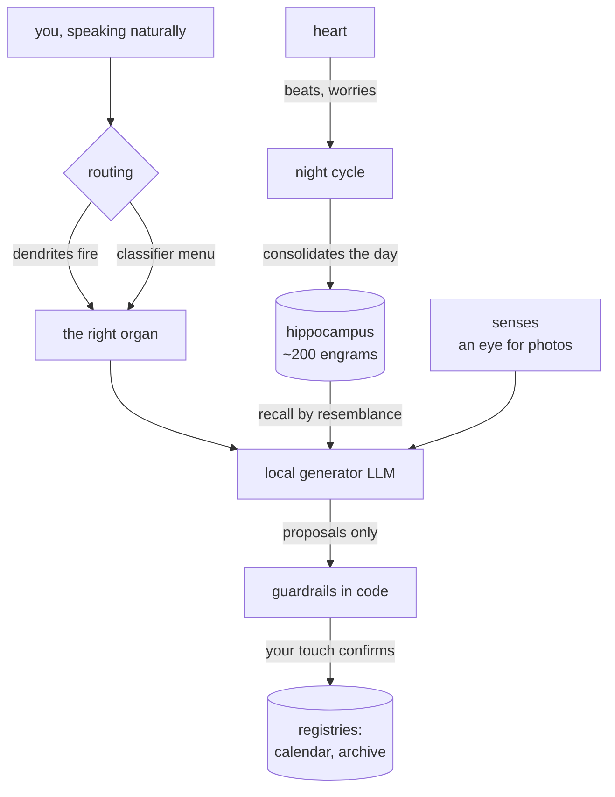
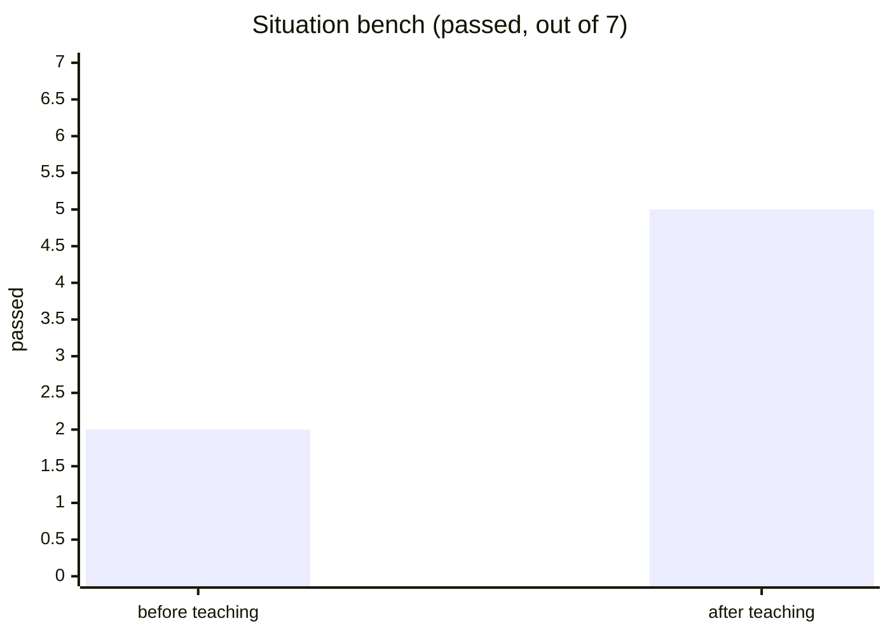
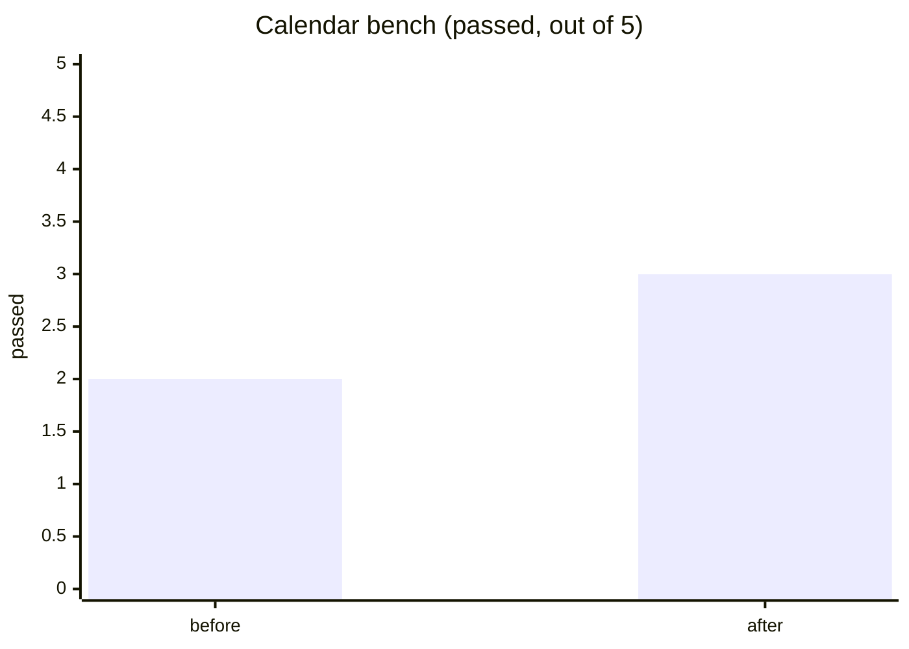
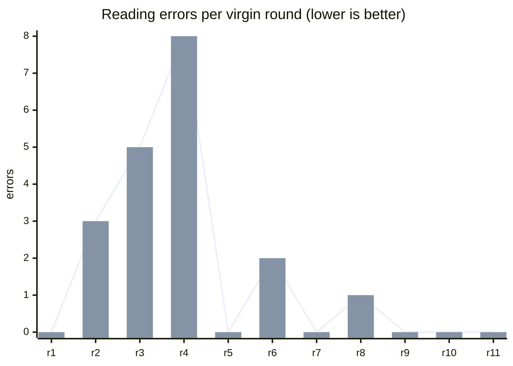
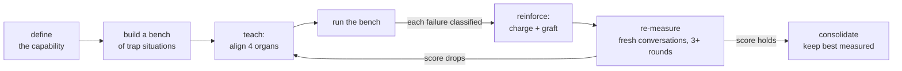
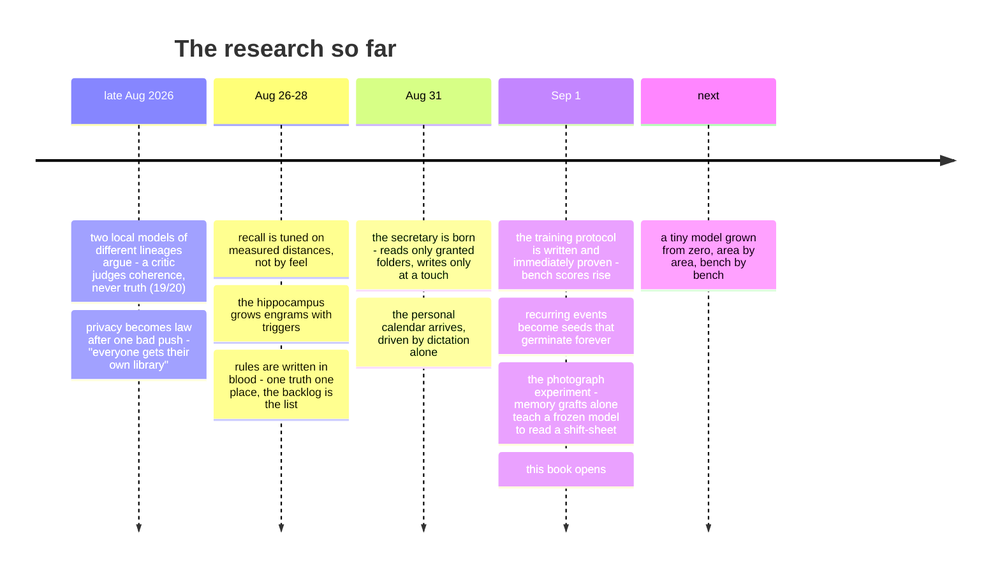

# Grindstone Research Book

*the public notebook of a private experiment — grindstone-eleven*

Somewhere in northern Italy, on ordinary consumer hardware, a small
system is being **raised rather than programmed**. It runs entirely at
home: no cloud, no telemetry, no data leaving the house. That
constraint is not a limitation of the project — it *is* the project.

> **This file is the project's living document.** Findings land here as
> they mature. The original `grindstone` README is deprecated and kept
> only as history.

---

## The idea in one line

**Behaviors are memories, not code.** Every capability the system gains
is taught — grafted as a discrete memory with its own triggers,
recalled by resemblance, reinforced when it serves and weakened when it
fails — and every claim of learning is backed by a measured score.

## Architecture, briefly

Every organ follows one standard: **declared functions** (a manifest),
**written rules** (a mandate in plain text — corrected by teaching,
never by editing code), and **hard guardrails** (contracts the model
cannot negotiate). What the model proposes, deterministic hands verify
before anything is written — and writing happens at a human's touch.

## Measured results (the graphs that went up)

An independent critic model judges every answer's coherence before
delivery — benchmarked at **19/20** on its confusion matrix.

Capabilities are trained through a written protocol and measured on
benches of trap-situations, before and after teaching:

### The photograph experiment (September 2026)

Can a frozen model learn to read a photographed shift-sheet — a messy
real-world grid — through **memory grafts alone**? Every round is a
fresh conversation with no notes to lean on: if the score improves,
the improvement lives in the system's memory, nowhere else.

Rounds 1–5: the lessons existed but **never woke up** — the memories'
triggers sat too far from the user's real phrasing, and recall stayed
silent. Rounds 6–8, after reshaping the triggers and teaching a
two-step method (*transcribe the row aloud, then extract from your own
transcription*): errors collapsed. Three lessons entered the protocol:

1. **A graft must be woken** — after every graft, test recall with the
   user's real sentence. A memory that never fires is a sleeping neuron.
2. **For visual tasks: two steps** — anchor visual attention to words
   before extracting.
3. **Too much procedure drowns the apprentice** — a stricter checklist
   *lowered* the score and was rolled back. Like model checkpoints:
   the best *measured* version is kept, not the latest written.
4. **When the residual error is perception, heal the organ, not the
   memory** — the last stubborn error (a neighbouring row bleeding into
   the reading) survived every graft. The cure was a pair of glasses:
   an adaptive image-preparation organ in the pipeline (upscale small
   photos, per-photo contrast, light sharpening) that now serves every
   photograph the system will ever see. Rounds 9–11: **zero errors,
   three times in a row** (chart above).
5. **Reading is not chatting** — the remaining run-to-run variance was
   sampling: with a photograph in hand, the model now decodes at
   temperature zero. Same photo, same reading, forever.

**Final exam**: five different shift-sheets — four never seen during
training, one with a vacation band crossing the row, one with an
odd early clock-out — two virgin rounds each: **10/10, zero errors,
twin rounds byte-identical**. Capability consolidated; experiment
closed. The frozen model reads the grid through what it remembers,
what it wears on its eyes, and how it is told to decide.

### Other results that held

- **Recurring events as seeds** — one stored entry germinates its
  occurrences forever (yearly, monthly, month's-end) when a month is
  viewed: verified out to 2031 and beyond, registry stays tiny.
- **Dictation as the only interface** — the personal calendar is driven
  by natural speech alone: creation, deep modification, deletion
  (the model reads the live agenda and names exact entries; code only
  finalizes exact matches).
- **Self-poisoning cured by memory** — a long chat in which the system
  once denied a capability used to poison every later answer; a grafted
  *capability memory* («you can do X; if you said otherwise, it was an
  error») ended the relapses.
- **Corrections that stick** — mistakes are charged to the specific
  memories that caused them (pain), the lesson is grafted back, and the
  same bench re-measures. Praise reinforces. Bench scores above.
- **The heart learned to knock** — real system notifications on a
  phone, end to end from the house: the heart watches the agenda once
  a minute, a good-morning digest at 8:00, a knock half an hour before
  every appointment. The push gateway carries only ciphertext; the
  words are composed, encrypted and remembered at home.

## The training protocol (distilled from failures)

Four organs must align for any new capability: the **routing dendrites**
(real phrases → right room), the organ's **mandate**, a **capability
memory** recallable from any room, and the **dispatcher** that must be
introduced to the newcomer. Nearly every failure so far was exactly one
of these four left behind.

## Timeline

## What comes next

A model of its own, **grown from zero** on the same desk — tiny, modern
in architecture (a mixture of small experts behind a learned router),
raised area by area with a curriculum, each area guarded by its own
bench so new learning can never silently break old. It has a name
already. It will earn its page here when it earns its scores.

## What the companion can do today

Everything below runs on one consumer desktop, reachable only through a
private mesh network. No cloud, no subscriptions, no data leaving the
building.

**Conversation & judgement**
- Private chat with local models; an independent critic of a different
  lineage reviews every answer's coherence before delivery (19/20 on
  its benchmark), with one honest regeneration on failure — and a
  visible trail of how each answer was made.
- Live tables, charts, structured cards and choice-prompts in chat;
  images understood through an adaptive visual pipeline.
- A local library (RAG) that answers only from its own shelves and says
  so when the shelves are silent; optional supervised learning from the
  web.

**Memory that learns**
- A hippocampus of teachable memories: capabilities are taught, scored
  on benches, reinforced or weakened — never hardcoded. A written
  training protocol makes any new skill repeatable.
- Routing dendrites send each request to the right organ; night cycles
  consolidate the day into next-morning proposals.

**The secretary**
- Reads and files documents only in folders the owner has granted, one
  by one; every write is a proposal a human confirms with a touch.
- A filing doctrine lives inside the archive itself, editable by hand.

**The calendar**
- An installable private calendar driven by dictation alone: create,
  modify, move by common trait («move today's shipments to tomorrow»),
  delete by name — recurring events stored as seeds that germinate
  forever.
- Reads photographed shift-sheets into the agenda (final exam: 10/10
  across five different sheets); appointments and reminders kept
  visually and semantically distinct.
- Real system notifications on the phone: a good-morning digest and a
  knock before each appointment — composed and encrypted at home, the
  push gateway carries only ciphertext.

**The safety rails**
- Read-only by default: the system never deletes, sends or executes on
  its own; the owner's touch is the only pen.
- A pre-commit guardian scans anything leaving the house for keys,
  personal data and unexamined images — with different severity for
  public and private destinations.
- Every module ships with declared functions, a written mandate, and
  hard guardrails the model cannot negotiate.

## For companies

This architecture — a local, teachable, privacy-first assistant that
learns your procedures through measured training instead of custom
code — can be adapted to a company's own hardware and knowledge:
document filing with your folder doctrine, schedules from your paper
forms, notifications on your team's phones, all inside your walls.

If that sounds like something your organization needs, reach out
through this repository — open an issue, or contact the owner via the
GitHub profile.

## What stays private

The code, the library, the memories and the life inside them belong to
the person the system serves. They remain in the private garden.

*Active research, summer 2026 →*
